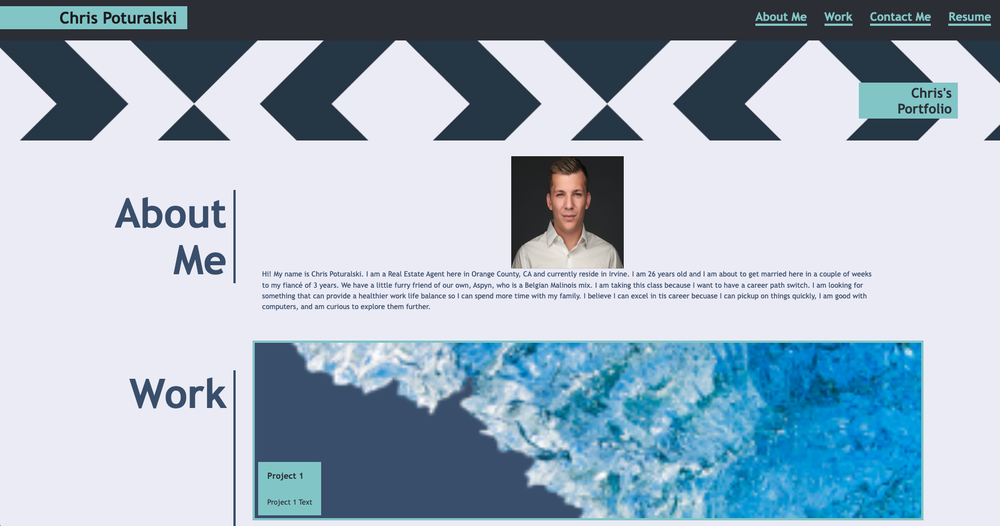
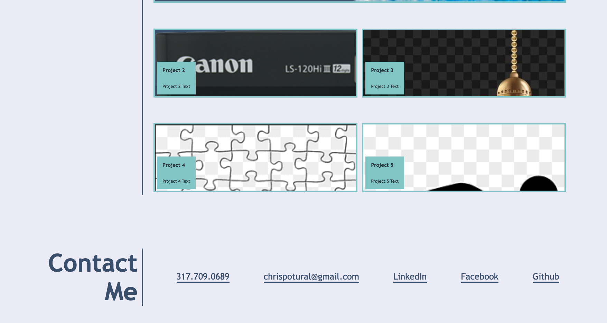

## H2 Challenge

# Description

GIVEN I need to sample a potential employee's previous work
WHEN I load their portfolio
THEN I am presented with the developer's name, a recent photo or avatar, and links to sections about them, their work, and how to contact them
WHEN I click one of the links in the navigation
THEN the UI scrolls to the corresponding section
WHEN I click on the link to the section about their work
THEN the UI scrolls to a section with titled images of the developer's applications
WHEN I am presented with the developer's first application
THEN that application's image should be larger in size than the others
WHEN I click on the images of the applications
THEN I am taken to that deployed application
WHEN I resize the page or view the site on various screens and devices
THEN I am presented with a responsive layout that adapts to my viewport

# Installation

N/a

# Usage

To use this project, you will be able to open up the live URL in Chrome through the DevTools by pressing Command+Option+I on mac OS. A console panel should open either below or to the side of the webpage in the browser.

# Credits

I credit Chad and Nick and the rest of the UCI Bootcamp for teaching me the tools to complete this task.

# License

Please refer to the LICENSE in the REPO

# Features

N/a

# How to Contribute

N/a

# Tests 

N/a

# Mock-UP

Please refer to the follow images for a mockup of my results:

# Website Link

